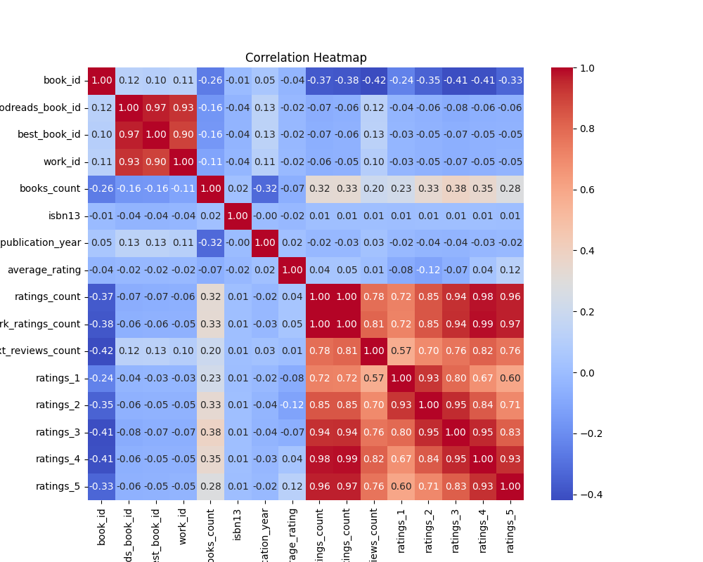
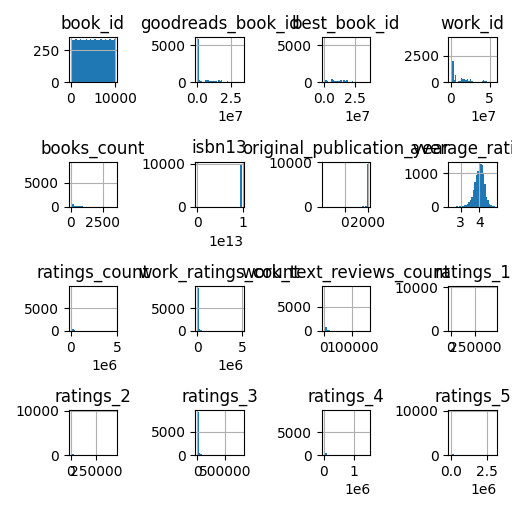

# Automated Analysis

## Narration
Once upon a time in the vast universe of literature, there existed a captivating dataset that chronicled the adventures of 10,000 books, each more enchanting than the last. This dataset served as a magical repository of knowledge, preserving the essence of stories that spanned genres, authors, and time periods, all captured in its 23 columns.

In the heart of this dataset was the *book_id*, a unique identifier that unlocked the secrets of each literary work. With *goodreads_book_id* and *best_book_id* as trusted companions, they paved the way for readers to discover beloved tales and hidden gems alike. Each book was more than just a title; it was a world encapsulated in pages waiting to immerse readers in new experiences.

Authors adorned the dataset like stars glimmering in the night sky. From Suzanne Collins, who captured hearts with “The Hunger Games,” to the timeless words of F. Scott Fitzgerald in “The Great Gatsby,” every entry showcased the creative prowess of literary luminaries. Their works traveled through time, with the *original_publication_year* revealing the years when these masterpieces first graced shelves, allowing readers to appreciate the evolution of storytelling through the ages.

The titles, carefully crafted, beckoned book lovers into their narratives. "Harry Potter and the Sorcerer's Stone" ignited imaginations of young wizards, while "To Kill a Mockingbird" challenged societal norms and stirred introspection. Each title contained within it a treasure trove of emotions, themes, and lessons, all waiting to be discovered.

As readers flipped through the dataset, they were greeted with the enchanting sound of ratings, numbers reflecting the collective admiration of countless readers. With an impressive *average_rating*, books captured not just passion but validation across their respective genres. The *ratings_count* tallied the echoes of applause from thousands, each click a testament to the book's ability to resonate, inspire, and entertain.

The dataset didn’t merely stop at numbers; it breathed life into reviews, with *work_text_reviews_count* revealing the voices of readers sharing their reflections and critiques. The enthusiasts and critics alike poured their thoughts into this vast ocean of literature. From glowing praise to contemplative critiques, each review added depth to the understanding of a book, creating a community united by a shared love for reading.

Images of stunning book covers visualized the stories locked within, with every *image_url* painting a picture of what awaited within the pages. The covers reflected the aura of each tale, some whimsical, others somber, yet all irresistibly alluring, urging readers to embrace their next literary adventure.

As the dataset continued to grow and evolve, it became a sanctuary. It served not only as a catalog of books but also as a testament to the human experience, encapsulating stories that transcended cultural and temporal boundaries. Readers could lose themselves in fiction and nonfiction, fantasy and reality, with every entry a portal to another existence, another heartbeat.

In this universe of stories contained within a dataset, the love for books blossomed, connecting countless readers with adventures just waiting to unfold. The dataset stood as a reminder of the power of literature, the beauty of storytelling, and the timeless bond it created among those who turned its pages. And thus, in the realm of data and literature, the magic of stories lived on, ever captivating and eternal.

## Visualizations

