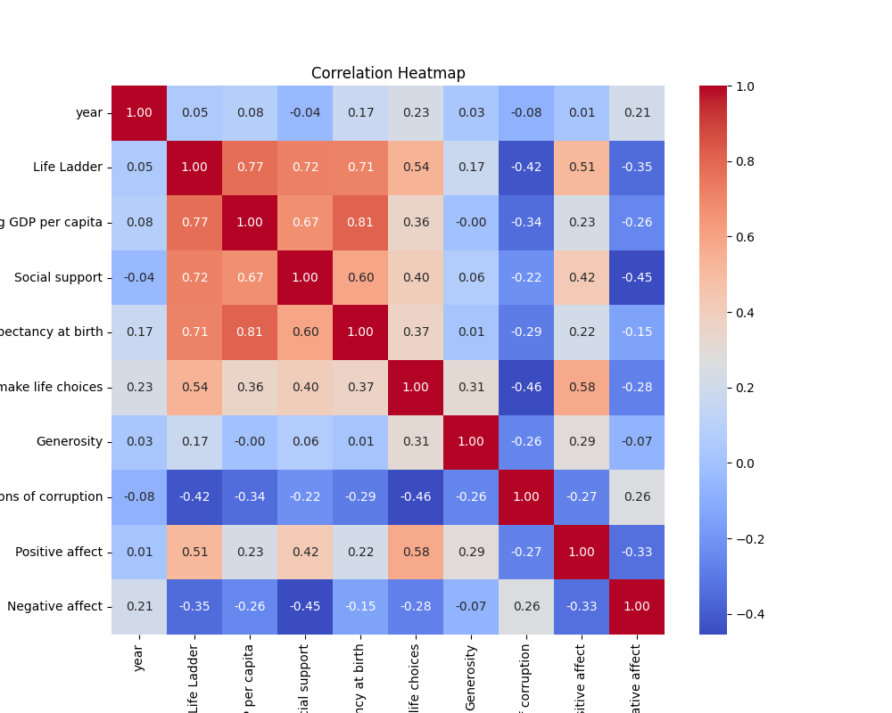
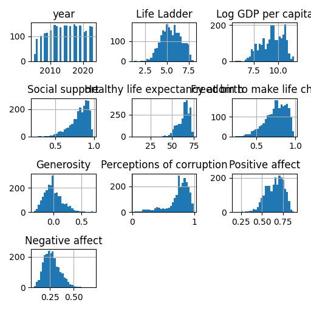

# Automated Analysis

## Narration
Once upon a time in the realm of data analytics, a treasure trove of information emerged, brimming with insight about the well-being and happiness of nations across the world. This dataset, consisting of 2,363 rows and 11 rich columns, was more than just numbers; it was a narrative of human experience.

At the heart of this data was the **Life Ladder**, a representation of happiness and life satisfaction as experienced by individuals across various countries. It was intertwined with other compelling indicators: **Log GDP per capita**, a reflection of economic prosperity; **Social support**, which captured the strength of community ties; **Healthy life expectancy at birth**, telling tales of health and longevity; and the **Freedom to make life choices**, signifying the autonomy people felt in their lives. 

As our analysts dove deeper, they found captivating stories emerging from the columns. Take for instance **Afghanistan**, a nation featured prominently in the dataset. Over the years from 2008 to 2012, the data revealed fluctuations in happiness, mirrored by changes in economic conditions and social factors. For instance, in 2009, the Life Ladder jumped to 4.402, an uplifting moment correlated with a rise in **Social support** and a slight improvement in **Healthy life expectancy**. This suggested a time when the bonds within communities were strengthening, bringing warmth and connection amidst adversity.

The dataset not only captured individual countries but also provided a kaleidoscope view of global practices. As analysts examined trends, they noted how economic growth, measured through **Log GDP per capita**, often coincided with enhancements in social well-being, yet discerned that happiness was not solely dictated by wealth. A rich nation could exhibit high **Perceptions of corruption**, which might darken the joy of its people, while poorer nations still found ways to foster **Generosity** and **Positive affect**.

Amid the complexities, the dataset illuminated contrasts; the dichotomy of **Positive affect** and **Negative affect** served as a powerful lens. Countries with lower happiness indices, like Afghanistan in certain years, battled against waves of negativity but showed sparks of resilience, such as an increase in the community’s ability to support one another and the gradual rise in freedom.

As the analysts pieced together these stories, they documented correlations, predictions, and narratives that transcended numbers. They engaged with policymakers, social scientists, and communities—building a bridge from the rows and columns of the dataset to real-world implications. They highlighted that while life satisfaction varied dramatically from one country to another, certain universal truths emerged: the importance of social connections, economic opportunities, health access, and the fundamental human desire for autonomy and choice.

The dataset became more than just a collection of measures on a spreadsheet; it transformed into a symphony of human experiences. Each entry was a note celebrating triumphs, acknowledging challenges, and offering pathways for improvement. Through data storytelling, they laid the foundation for renewed efforts aimed at enhancing happiness and quality of life across the globe—crafting a narrative that resonated in boardrooms, living rooms, and beyond, reminding all that the quest for happiness is both a personal journey and a global endeavor. 

And with that, the journey into the heart of data—and the stories it told—continued, ever evolving with each new row of insight unveiled.

## Visualizations

