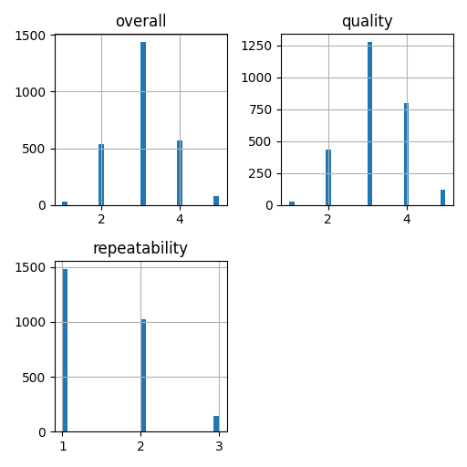

# Automated Analysis

## Narration
Once upon a modern time in the vibrant world of cinema, filmmakers from various linguistic backgrounds were weaving exciting narratives on screens big and small. In this creative realm, a dedicated team of data analysts embarked on a mission to explore the rich tapestry of films, capturing not just the stories told but also the responses of enthusiastic audiences.

Their journey began with a dataset filled with 2,652 captivating entries, each representing a unique film along with its myriad attributes. The columns told a story of their own: 'date', 'language', 'type', 'title', 'by', 'overall', 'quality', and 'repeatability'. Each entry was like a colorful thread, contributing to the larger narrative of cinematic expression.

The dataset was a treasure trove of information. It delved into the recent releases of Tamil and Telugu movies, showcasing how each film performed in the eyes of critics and fans alike. For instance, as they flipped through the first few rows, they found a delightful collection of films released in November and October of 2024—the world was eagerly debating the merits of these cinematic jewels.

Among them was "Meiyazhagan," a Tamil film that dazzled audiences with its overall rating of 4. It was lovingly crafted by the duo of Arvind Swamy and Karthi, whose talents shone bright. Not far behind, the stars Rajnikanth and Fahad Fazil graced "Vettaiyan," earning a more modest score of 2—a testament to the ever-changing tastes of the audience.

The analysts noticed a pattern developing in the ratings. "Quality," often seen as a metric of production value and storytelling, was most consistently rated higher, with "Meiyazhagan" once again standing tall with a perfect score of 5. However, the disappointments of “Vettaiyan” echoed through the critical conversations—was it the star power that failed to resonate this time, or was it a lack of innovative storytelling?

As October rolled in, the thoughts turned towards “Kushi” featuring the charismatic Vijay Devarakonda alongside Samantha. This film embraced its creative essence, earning a commendable score of 3, while “GOAT,” headlined by the ever-popular Vijay, seemed to straddle between promise and performance, lingering with an average rating.

With every entry analyzed, the data analysts began to paint a picture of what audiences valued most. Did the language of the film truly impact its reception? Were collaborative efforts by famous actors more successful in attracting viewership, or did the storytelling reign supreme?

The "overall" ratings were often matched with the "repeatability" scores, revealing that films which garnered higher ratings in quality often encouraged viewers to watch them multiple times. This spoke volumes about the depth of connection films could forge with their audience, encouraging a relationship that transcended a one-time viewing experience.

As the dataset grew under their keen observant eyes, patterns emerged like constellations—films that combined strong narratives with renowned talents tended to shine the brightest. Insights began to flow, suggesting that engaging stories, rich in cultural nuances, won the hearts of the people.

In the end, they meticulously documented their findings, ready to share with filmmakers, critics, and admirers alike. Their objective was not just to catalog the past but to inspire the future of cinema—to encourage creators to explore the dynamic fabric of storytelling, no matter the language, to ensure that tales from every corner of the world could find their moment in the spotlight.

So as the flickering lights of theaters cast dancing shadows, the analysts continued to enrich the world of cinema with their statistical storytelling, reminding everyone that behind every film was a universe waiting to be captured and celebrated in the shared language of cinema.

## Visualizations

